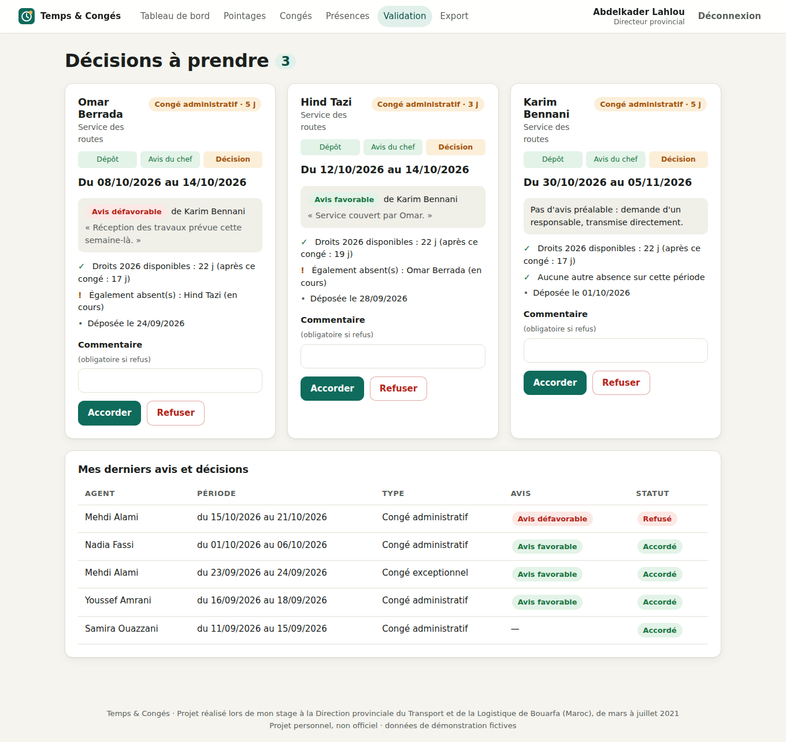
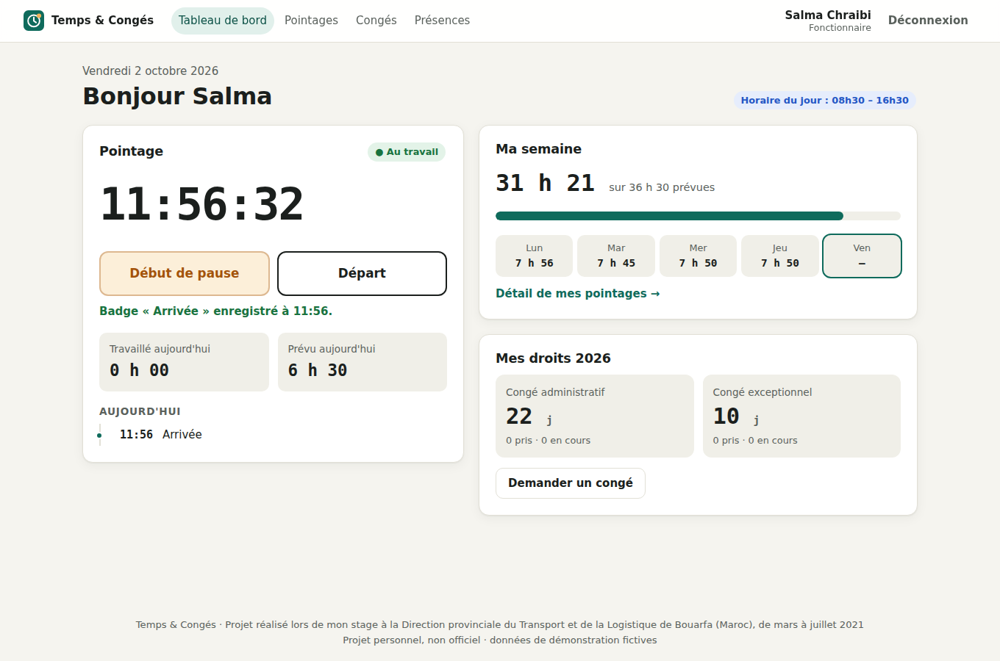
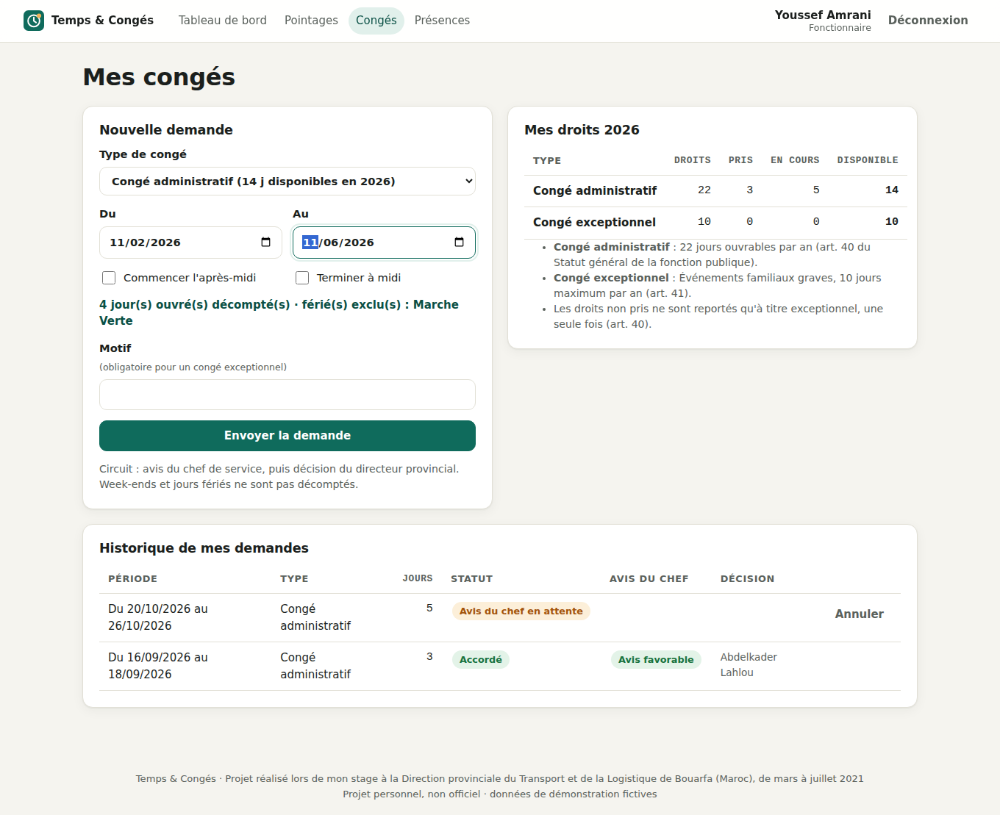
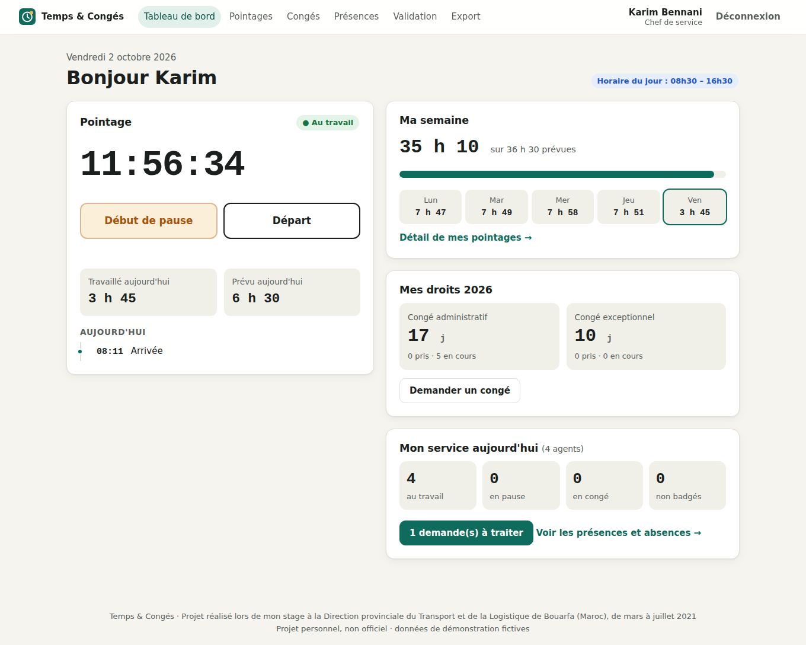
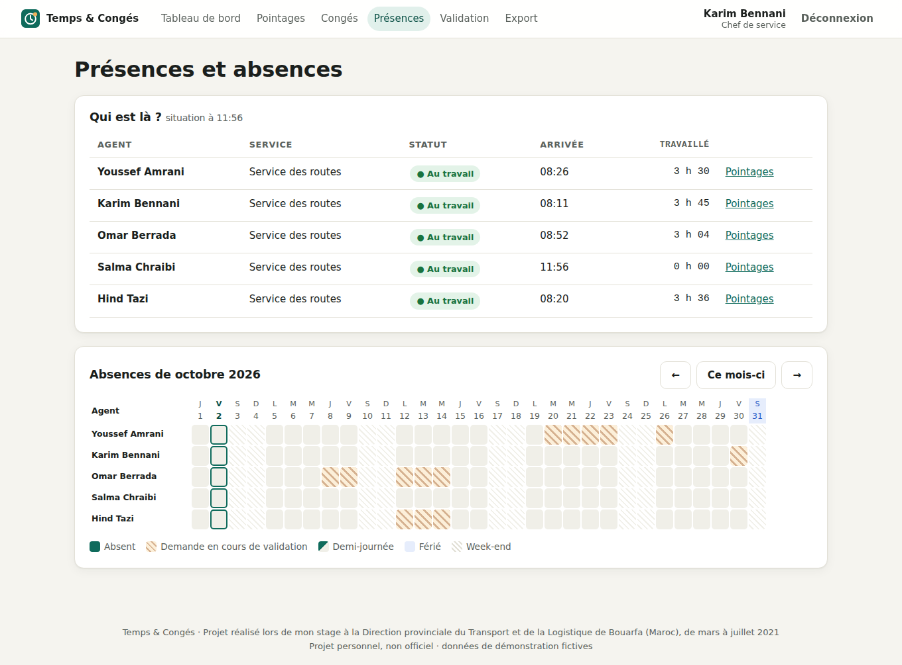
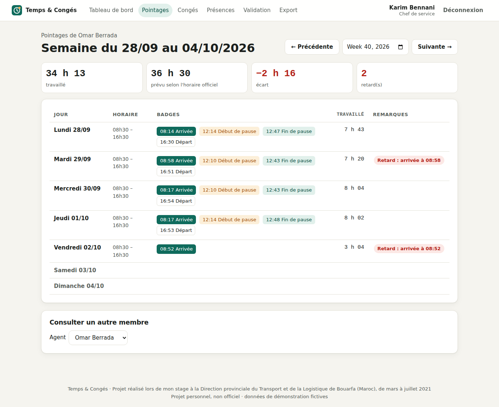
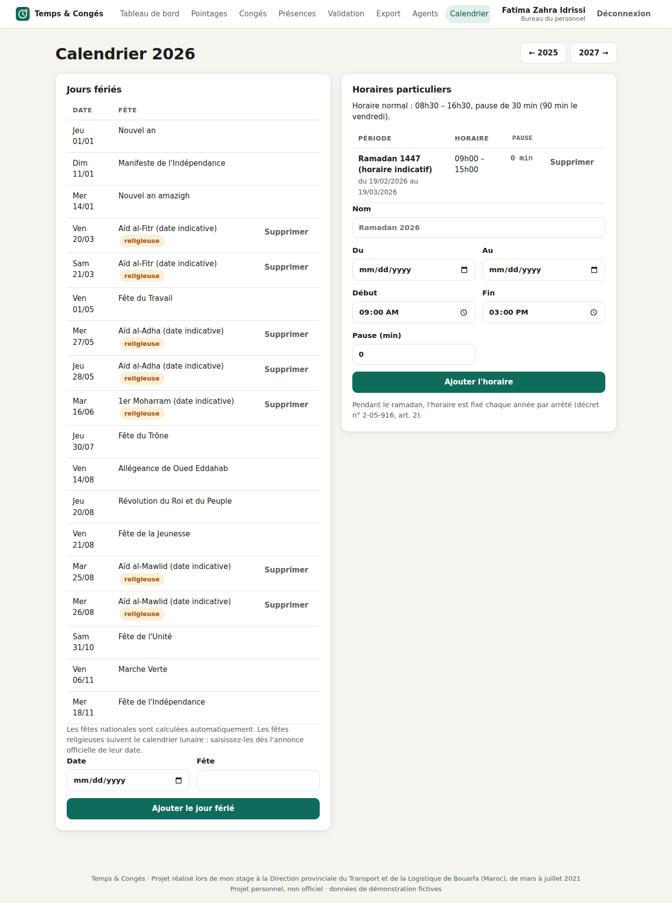
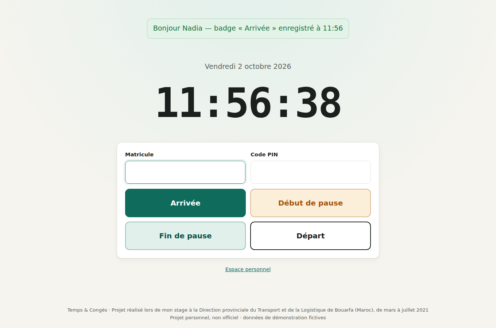
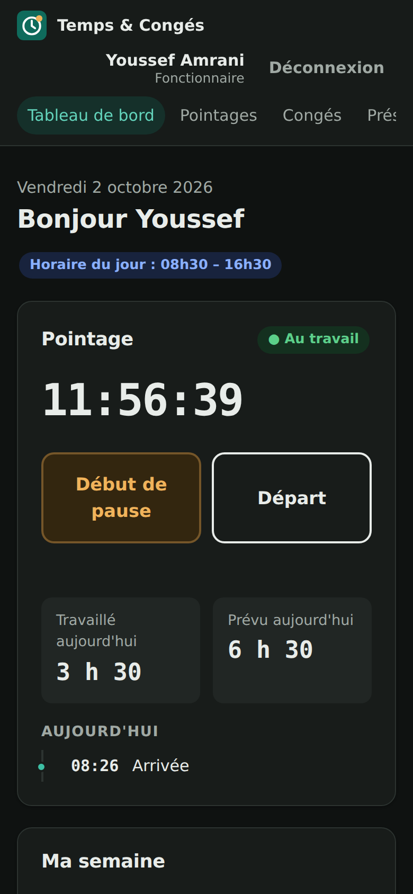

# Temps & Congés

[](https://github.com/naggaz-alae/projet9/actions/workflows/ci.yml)

Une petite application web pour gérer les badgeages et les demandes de congé dans une administration publique marocaine.

## D'où vient ce projet

J'ai fait mon stage de mars à juillet 2021 à la Direction provinciale du Transport et de la Logistique de Bouarfa.
Là-bas, les présences et les congés étaient suivis sur papier. C'était mon tout premier projet de développement,
et l'idée était simple : remplacer ce papier par une application.

En 2026 je l'ai repris pour le nettoyer : j'ai ajouté des tests, renforcé la sécurité et rendu l'application
installable sur un PC comme un logiciel classique.

Ce n'est pas une application officielle de l'administration. Toutes les personnes et les données de démo sont inventées.



## Ce que fait l'application

Un agent badge quand il arrive, quand il part en pause et quand il s'en va. Il voit combien d'heures il a faites
dans la journée et dans la semaine, et il peut demander un congé.

La demande suit le même chemin qu'en vrai :

```
l'agent dépose → le chef de service donne son avis → le directeur décide
```

Le chef peut donner un avis défavorable (il doit alors dire pourquoi), mais c'est le directeur qui a le dernier mot.
Si c'est un chef qui demande un congé, sa demande va directement au directeur. Le congé du directeur, lui,
est saisi par le bureau du personnel. Personne ne peut valider sa propre demande.

Il y a cinq profils :

- **Fonctionnaire** : badger, voir son temps de travail, demander un congé, suivre sa demande.
- **Chef de service** : voir qui est présent dans son service, donner son avis sur les demandes, exporter les pointages.
- **Directeur provincial** : accepter ou refuser les demandes, voir toute la direction.
- **Bureau du personnel** : gérer les agents et leurs droits, remplir le calendrier de l'année, exporter.
- **Borne** : un PC ou une tablette à l'entrée, où l'on badge avec son matricule et un code PIN.

L'application signale aussi les retards, les départs avant l'heure et les badges de départ oubliés.

| | |
|---|---|
|  |  |
|  |  |
|  |  |

<p align="center">
  
  
</p>

## Les règles qu'il a fallu respecter

Le plus intéressant dans ce projet, c'était de comprendre les règles de la fonction publique et de les traduire en code :

- **Les horaires** : du lundi au vendredi, de 8h30 à 16h30, avec 30 minutes de pause.
  Le vendredi, la pause dure une heure de plus pour la prière. Ça fait 7h30 par jour du lundi au jeudi,
  6h30 le vendredi, donc 36h30 par semaine (décret n° 2-05-916 de 2005).
- **Le ramadan** a ses propres horaires, fixés chaque année. Le bureau du personnel les saisit dans le calendrier.
- **Le congé administratif** : 22 jours ouvrables par an, et seulement après 12 mois de service.
  Un report à l'année suivante reste exceptionnel (statut général de la fonction publique, article 40).
- **Les congés exceptionnels** pour les événements familiaux : 10 jours maximum par an (article 41).
- **Les jours fériés** : les fêtes nationales tombent toujours à la même date, l'application les calcule seule.
  Elle tient compte des fêtes ajoutées récemment (le Nouvel an amazigh depuis 2024, la Fête de l'Unité depuis 2026).
  Les fêtes religieuses, elles, dépendent de l'observation de la lune : impossible de les prévoir,
  donc le bureau du personnel les rentre chaque année.

Quand on pose un congé, seuls les jours de travail sont comptés : pas les week-ends, pas les jours fériés.
On peut aussi prendre des demi-journées.

## Le lancer sur son PC

Il faut PHP 8.1 ou plus récent, avec l'extension `pdo_sqlite` (déjà incluse dans XAMPP, WAMP ou Laragon).

```bash
git clone https://github.com/naggaz-alae/projet9.git
cd projet9
php database/installer.php --demo
php -S localhost:8000 -t public
```

Ensuite, ouvrez http://localhost:8000. Le mot de passe est `demo1234` pour tous les comptes :

| Profil | Identifiant |
|---|---|
| Fonctionnaire | `fonctionnaire@demo.test` |
| Chef de service | `chef@demo.test` |
| Directeur | `directeur@demo.test` |
| Bureau du personnel | `personnel@demo.test` |
| Borne | matricule `F001`, PIN `1234` |

Les données de démo partent de la date d'installation : trois semaines de badgeages (avec quelques retards et oublis),
des demandes de congé à toutes les étapes, et une nouvelle recrue qui n'a pas encore droit au congé.
Les dates des fêtes religieuses et du ramadan 2026 sont des estimations.

### L'installer comme une application

Dans Chrome ou Edge, une icône « Installer » apparaît dans la barre d'adresse. Après ça, l'application s'ouvre
dans sa propre fenêtre et a son icône dans le menu Démarrer. Techniquement, c'est une PWA.
Rien n'est gardé en cache : les données restent sur le serveur. Il faut du HTTPS, sauf en local.

## Comment c'est construit

Aucun framework ni aucune bibliothèque : seulement du HTML, du CSS, du JavaScript et du PHP.

```
public/     les pages, l'API (badgeage, calcul des jours), le CSS et le JS
src/        toute la logique : calendrier, horaires, pointage, congés, agents, sécurité
database/   les schémas SQLite et MySQL, et le script d'installation
tests/      les tests
config/     la configuration (horaires, droits, base de données)
```

Seul le dossier `public/` est accessible depuis le navigateur. Les classes de `src/` reçoivent la base de données
et la date du jour en paramètre. Ça permet de tester n'importe quelle règle à n'importe quelle date,
par exemple de vérifier qu'un congé posé en 2021 ne tient pas compte d'une fête ajoutée en 2024.

Le badgeage fonctionne comme une suite d'états : on ne peut pas arriver deux fois, ni partir en pause sans être arrivé.

```
absent ──arrivée──► présent ──pause──► en pause
  ▲                   │  ▲               │
  └──────départ───────┘  └──fin de pause─┘
```

## Sécurité

Ce que j'ai mis en place :

- toutes les requêtes SQL sont préparées, pour éviter les injections ;
- tout ce qui est affiché est échappé, et une politique CSP bloque les scripts écrits directement dans la page ;
- chaque formulaire porte un jeton CSRF ;
- les mots de passe et les codes PIN sont hachés avec bcrypt ;
- après 5 essais ratés, le compte est bloqué 15 minutes ;
- les droits sont vérifiés côté serveur : un agent ne voit que ses propres pointages, un chef seulement son service ;
- dans le calendrier, les collègues voient qu'une personne est absente, mais pas le type de congé.

## Tests

```bash
php tests/run.php      # 39 tests unitaires
bash tests/fumee.sh    # 26 vérifications sur un vrai serveur
```

Les tests unitaires tournent avec un petit outil de test écrit en PHP, sans PHPUnit. Le deuxième script démarre
le serveur et refait un vrai parcours avec `curl` : connexion, badge, dépôt d'une demande, avis du chef,
accord du directeur, tentatives d'accès interdites, export.

GitHub Actions lance tout ça à chaque push, avec PHP 8.1, 8.2, 8.3 et 8.4.

## Exports

Le chef (pour son service), le directeur et le bureau du personnel (pour toute la direction) peuvent exporter
en CSV les pointages jour par jour (avec les retards et les oublis) et la liste des congés.
Il y a un format pour Excel et un format standard pour Python ou Power BI.

## Utiliser MySQL

Pour une vraie installation, créez un fichier `config/config.local.php` :

```php
<?php return [
    'demo' => false,
    'db' => ['dsn' => 'mysql:host=localhost;dbname=rh;charset=utf8mb4', 'utilisateur' => '…', 'mot_de_passe' => '…'],
];
```

Lancez ensuite `php database/installer.php` (sans `--demo`), faites pointer le site sur le dossier `public/` et activez HTTPS.
N'oubliez pas de remplir les fêtes religieuses et les horaires du ramadan chaque année.

## Ce qui manque encore

- Les autres congés (maladie, maternité, pèlerinage…) : ils demandent des justificatifs, je ne les ai pas faits.
- La correction d'un badge par le bureau du personnel, avec un historique.
- Des notifications par e-mail ou par SMS.
- Une version en arabe.

## Licence

MIT, voir [LICENSE](LICENSE).
